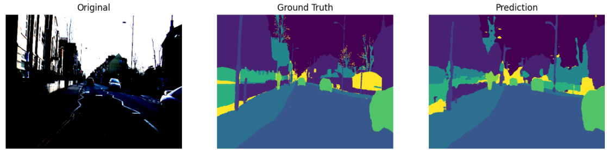
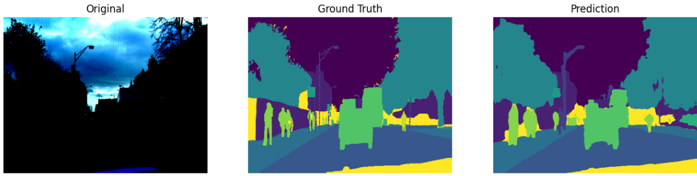
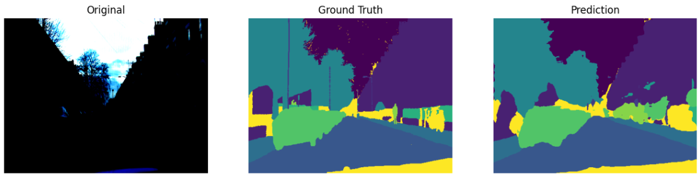

# Semantic Segmentation using U-Net and DeepLabV3+

A complete semantic segmentation pipeline implemented in PyTorch, comparing progressively improved U-Net architectures with DeepLabV3+ on the CamVid dataset.

<p align="center">

</p>

The project explores modern semantic segmentation techniques, evaluates different training strategies, and provides quantitative and qualitative comparisons between three model baselines.

---

## Project Overview

Semantic segmentation assigns a semantic label to every pixel in an image. This project implements and compares multiple segmentation architectures while analyzing their strengths and limitations.

Three progressively improved baselines were developed:

| Baseline | Model | Main Improvements |
|----------|-------|-------------------|
| Baseline 1 | U-Net | Basic implementation with pretrained encoder |
| Baseline 2 | Improved U-Net | Better training pipeline, Dice Loss, augmentations, mixed precision |
| Baseline 3 | DeepLabV3+ | ASPP, atrous convolutions, multi-scale context aggregation |

---

## Dataset

### CamVid

CamVid is an urban scene understanding dataset containing pixel-level annotations for road-driving images.

### Classes

`Sky` • `Building` • `Pole` • `Road` • `Pavement` • `Tree` • `Sign Symbol` • `Fence` • `Car` • `Pedestrian` • `Bicycle` • `Unlabelled`

---

# Model Architectures

## Baseline 1 — U-Net

<p align="center">

</p>

Features

- Custom U-Net implementation
- Pretrained ResNet Encoder
- Skip Connections
- Transposed Convolution Decoder
- CrossEntropy Loss

---

## Baseline 2 — Improved U-Net

Improvements over Baseline 1

- Dice + CrossEntropy Loss
- Data Augmentation
- AdamW Optimizer
- Learning Rate Scheduler
- Automatic Mixed Precision (AMP)
- Better weight initialization
- Improved decoder blocks
- Better regularization

---

## Baseline 3 — DeepLabV3+

Features

- DeepLabV3+ architecture
- Atrous Spatial Pyramid Pooling (ASPP)
- Dilated Convolutions
- Encoder-Decoder Design
- Low-level Feature Fusion
- Multi-scale Context Aggregation
- Dice + CrossEntropy Loss
- Mixed Precision Training

---

# Training Configuration

| Parameter | Value |
|-----------|------|
| Framework | PyTorch |
| Dataset | CamVid |
| Optimizer | AdamW |
| Loss | Dice + CrossEntropy |
| Scheduler | CosineAnnealingLR |
| Mixed Precision | Yes |
| Encoder | Pretrained |
| Evaluation Metrics | Pixel Accuracy, Mean IoU |

---

# Data Augmentation

The training pipeline includes:

- Random Horizontal Flip
- Random Rotation
- Random Crop
- Color Jitter
- Normalization
- Tensor Conversion

---

# Evaluation Metrics

The following metrics were used during training and evaluation.

| Metric | Description |
|---------|------------|
| Training Loss | Optimization objective |
| Validation Loss | Generalization performance |
| Pixel Accuracy | Percentage of correctly classified pixels |
| Mean IoU | Mean Intersection over Union |
| Per-Class IoU | IoU for every semantic class |
| Confusion Matrix | Class-wise prediction analysis |

---

# Results

| Model | Pixel Accuracy | Test IoU |
|--------|---------------|----------|
| Baseline 1 | 0.8050 | 0.3422 |
| Baseline 2 | 0.7931 | 0.4897 |
| DeepLabV3+ | 0.8667 | 0.5870 |

---

# Qualitative Results

The repository includes visual comparisons showing:

- Original Image
- Ground Truth Mask
- Predicted Segmentation

Examples are available in

```
predictions/
```
<p align="center">

</p>

<p align="center">

</p>

<p align="center">

</p>

---

# Error Analysis

## Baseline 1

### Strengths

- Correct segmentation of large regions
- Stable predictions for road and sky
- Simple architecture with fast inference

### Common Errors

- Poor boundary localization
- Small object omission
- Thin structures not preserved
- Pole and sign confusion
- Pedestrian fragmentation
- Bicycle misclassification
- Boundary bleeding
- Class imbalance effects
- Low confidence on rare classes

Performed analyses

- Pixel Accuracy
- Mean IoU
- Per-Class IoU
- Confusion Matrix
- Visual prediction comparison

---

## Baseline 2

Compared with Baseline 1

### Improvements

- Better object boundaries
- Higher IoU
- Better convergence
- Reduced overfitting
- Improved minority class prediction
- Better small object segmentation

Remaining Errors

- Thin poles remain difficult
- Fence boundaries
- Bicycle prediction
- Occluded pedestrians
- Confusion between pavement and road
- Small sign symbols
- Tree boundary artifacts

Performed analyses

- Training vs Validation Curves
- Confusion Matrix
- Per-Class IoU
- Failure Case Visualization
- Boundary Quality Analysis

---

## Baseline 3 — DeepLabV3+

Observed Improvements

- Highest Mean IoU
- Better global context understanding
- Better semantic consistency
- Improved multi-scale object recognition
- Superior boundary quality
- Better segmentation of distant objects

Remaining Challenges

- Very thin poles
- Small traffic signs
- Heavy occlusion
- Motion blur
- Rare classes
- Similar texture confusion
- Extremely small pedestrians

Performed analyses

- Pixel Accuracy
- Mean IoU
- Per-Class IoU
- Confusion Matrix
- Boundary Error Analysis
- Small Object Analysis
- Failure Case Gallery
- Visual Comparison
- Prediction Confidence Analysis

---

# Comparison of Baselines

| Feature | Baseline 1 | Baseline 2 | DeepLabV3+ |
|----------|------------|------------|------------|
| Pretrained Encoder | ✓ | ✓ | ✓ |
| Dice Loss | ✗ | ✓ | ✓ |
| Data Augmentation | Basic | Advanced | Advanced |
| Mixed Precision | ✗ | ✓ | ✓ |
| AdamW | ✗ | ✓ | ✓ |
| Learning Rate Scheduler | ✗ | ✓ | ✓ |
| ASPP | ✗ | ✗ | ✓ |
| Multi-scale Features | ✗ | ✗ | ✓ |
| Best Accuracy | | | ✓ |

---

# Acknowledgements

This project was developed as part of a deep learning semantic segmentation project focused on implementing and comparing modern segmentation architectures in PyTorch using the CamVid dataset.
